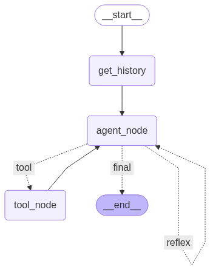

# automation_agents

[Watch the demo on YouTube](https://www.youtube.com/watch?v=WTT2oSbEaro)

## Project Overview

The project involves building an **Intelligent Ticket Resolution Agent** designed to automate and improve the handling of support tickets by leveraging advanced AI techniques and modern software tools.

## Agent Specification

The model is initialized with the following parameters:

- **model**: Specifies the language model to be used (default is `'qwen3:30b'`).
- **ollama_base_url**: The base URL for the Ollama local server instance (default is `'http://localhost:11434'`).
- **config**: Optional configuration dictionary for customizing model behavior or threading.
- **tools**: Optional list of external tools that the model can call during execution.

---

## Key Components and Innovations

1. **ReAct Paradigm (Reasoning and Acting):**  
   The agent is built using the ReAct framework, which allows it to perform step-by-step reasoning and dynamically call external tools as needed. This means the agent doesn’t just respond based on fixed templates but actively thinks through the problem and interacts with relevant tools to provide accurate solutions.

2. **Retrieval-Augmented Generation (RAG):**  
   To enhance the quality and reliability of its responses, the agent uses RAG. This enables it to fetch pertinent contextual information from a dedicated knowledge base in real-time, significantly reducing the chances of generating incorrect or fabricated answers (hallucinations).

3. **Memory Systems for Contextual Continuity:**  
   The project implements both **episodic memory** (to remember past interactions) and **instructional memory** (to retain important guidelines and instructions) through custom memory components. This ensures the agent understands the context over time and delivers coherent, relevant responses during ongoing conversations.

4. **Advanced Prompting Techniques:**  
   By utilizing **Chain of Thought prompting** and **Few-Shot learning examples**, the agent’s reasoning capabilities are improved, enabling it to better solve complex queries and adapt to specific tasks with minimal training examples.

5. **Privacy-Focused Language Model Execution:**  
   The language model runs locally using **Ollama**, a tool that allows for on-device AI processing. This guarantees that sensitive data stays secure and private, as no data is sent to external servers.

6. **Frontend & User Experience:**  
   A **React.js** frontend was developed using React hooks to manage state efficiently and provide a dynamic, interactive interface where users can see and engage with the agent’s responses in real time.

7. **Backend & Integration:**  
   The backend is powered by **FastAPI**, exposing RESTful API endpoints that facilitate smooth communication between the frontend and any third-party systems or databases.

8. **Database Management:**  
   The system uses **PostgreSQL** as its primary database, with **SQLAlchemy ORM** providing a clean and efficient way to interact with the database, manage tickets, user data, and agent logs.

## Workflow Overview

This graph illustrates the flow of the agent's execution process:

- **__start__**: The starting point of the process.
- **get_history**: Retrieves the history or context needed for the agent to operate.
- **agent_node**: The core decision-making node where the agent determines the next action.

From **agent_node**, the flow can branch into three possible directions:

- **tool_node**: If the agent decides to use an external tool, it transitions to this node.
- **__end__**: If the agent reaches a final conclusion or finishes its task, the process ends here.
- **Reflex Loop**: The agent can loop back to **agent_node** for reflexive reasoning or iterative processing before reaching a final decision.

This structured workflow enables the agent to dynamically interact with tools, maintain context, and decide when to conclude its task effectively.
